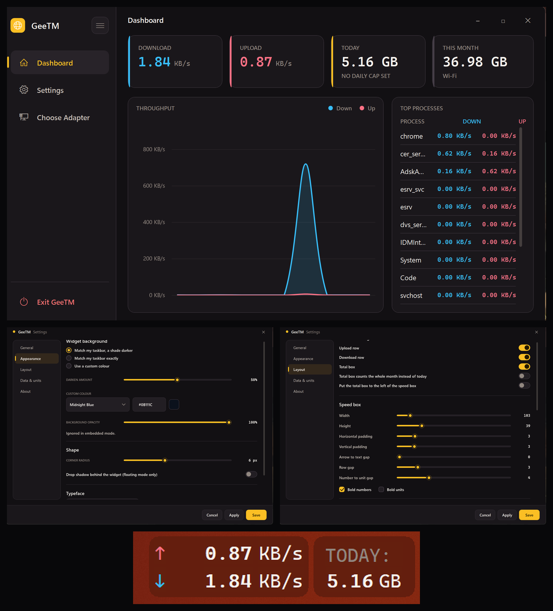
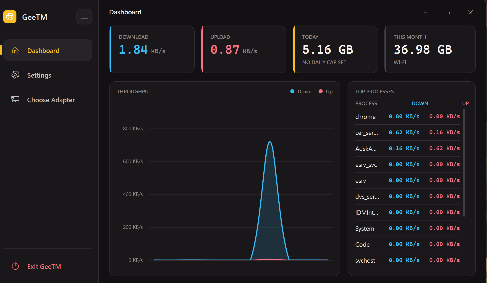
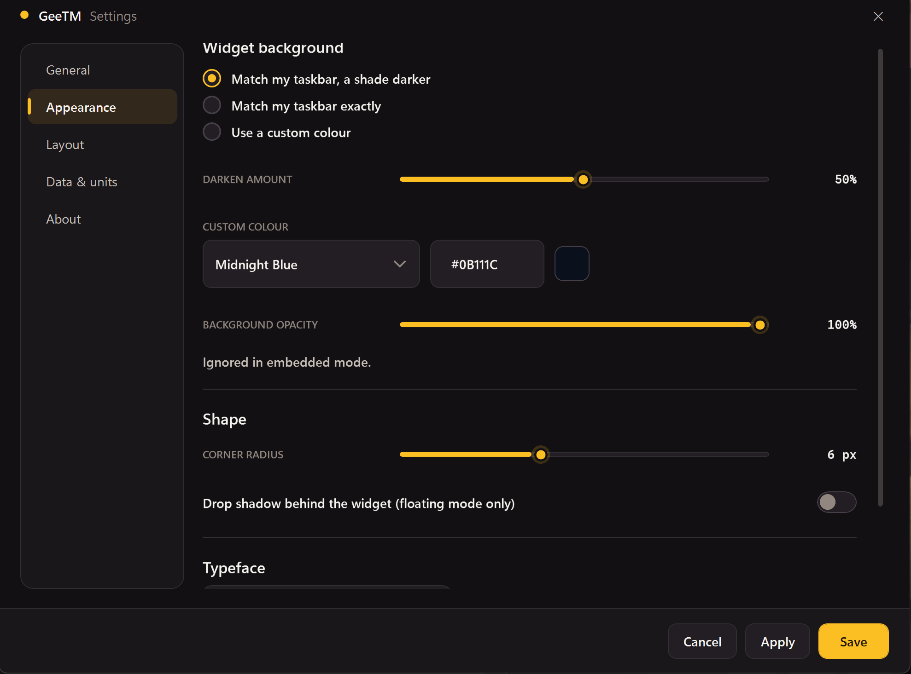
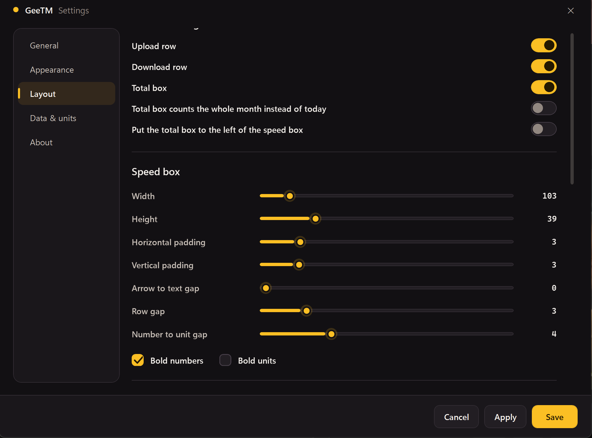

# GeeTM

A lightweight, premium-styled network traffic widget for Windows 11 — live upload/download speed, today's and this month's usage, and a dashboard with per-process bandwidth, right on your desktop.



## Why GeeTM

Most network monitors either bury useful numbers behind a click or clutter your screen with a heavyweight window. GeeTM sits quietly as a small floating widget (or embeds directly into your taskbar), shows exactly what you need at a glance, and gets out of the way otherwise.

- **Live speed at a glance** — upload and download, updating in real time
- **Daily and monthly usage tracking** — no surprises on a capped connection
- **A real dashboard** — throughput chart, live top-processes breakdown, usage history, and per-app data caps
- **Security-aware** — optional VPN connect/disconnect alerts and an IP threat score, right in the widget
- **Deeply customizable** — two visual styles, four color skins, pill shape and borders, fonts, spacing, and more
- **Two display modes** — a floating widget (recommended) or experimental taskbar embedding
- **Built to stay out of your way** — auto-hides behind Start and Quick Settings, or shows a small overlay while you're fullscreen

## Screenshots

| Dashboard | Appearance |
|---|---|
|  |  |

| Layout | Taskbar widget |
|---|---|
|  |  |

## Download

Grab the latest build from the [Releases](../../releases) page. Unzip it anywhere and run `GeeTM.exe` — no installer needed.

**Requires the [.NET 8 Desktop Runtime](https://dotnet.microsoft.com/download/dotnet/8.0).** If it's not already on your machine, Windows will detect this automatically the first time you run GeeTM and prompt you to install it — just follow the prompt, then relaunch GeeTM.

> **Note on the security warning:** since this build isn't code-signed yet, Windows SmartScreen may show an "unknown publisher" warning the first time you run it. Click **More info → Run anyway**. This is expected for a new, unsigned app — the same thing happens with most independently published Windows tools.

## Features

**Live monitoring**
- Real-time upload/download speed in the widget
- Today and this-month usage totals
- Per-process bandwidth tracking (requires running as administrator)
- A dashboard with a live throughput chart and a top-processes list
- Automatically picks the busiest active adapter by default (Wi-Fi, Ethernet, or VPN — whichever is actually carrying traffic)

**Rotating pill content**
- Optionally rotate a pill between its normal reading, your public IP address, and your location (country)
- Assign IP and location to either pill independently — share one pill or split them across both
- Optional IP threat score (via your own free [AbuseIPDB](https://www.abuseipdb.com/) API key), shown right alongside the IP
- Configurable rotation interval, with a smooth fade transition between what's showing

**Security awareness**
- Optional notification when a VPN connects or disconnects (best-effort adapter detection, not a guarantee)
- IP threat score integration, off by default and fully optional

**Usage history & data caps**
- A day-by-day usage history, broken down per network adapter
- Flags adapters that look local/virtual (Docker, WSL, and similar) rather than real internet traffic
- Set a daily data cap per application and get notified when it's crossed

**Appearance**
- Two visual styles — **Classic** (the original look) and **Premium** (softer glows, layered depth, refined accents) — mix and match with any color skin
- Four built-in color skins: Aurora, Midnight, Mono, Solar
- Background modes: match your taskbar exactly, match it a shade darker, or pick a custom color
- Two pill shapes: two independent rounded pods, or one shape divided by the gap between them (square inner corners, rounded outer corners)
- Optional pill border, with its own color and thickness, that automatically follows whichever pill shape you've chosen
- Adjustable corner radius, opacity, and an optional drop shadow (floating mode)
- A curated set of fonts for clean digit alignment

**Layout**
- Fine-grained control over widget size, padding, and spacing
- Toggle the upload row, download row, and the totals box independently
- Move the totals box to either side of the speed box
- Manual positioning, or dock automatically beside the system tray

**Behavior**
- Launches with Windows (optional)
- Hides automatically while anything else is fullscreen — or shows a small, click-through overlay instead, handy while gaming or streaming
- Optional click-through mode
- Settings save atomically, so a crash or power loss can never corrupt your configuration

## Display modes

**Floating (default, recommended)** — a small always-on-top window that docks beside your system tray. Fully supported and the mode most people should use.

**Embedded in the taskbar (experimental)** — GeeTM renders directly inside the taskbar itself, next to the clock. This works well on most setups but is newer and less battle-tested than floating mode — if you hit anything odd, switching back to floating mode is one toggle away in Settings.

## Building from source

Requires the [.NET 8 SDK](https://dotnet.microsoft.com/download/dotnet/8.0) and Windows (WPF only builds and runs on Windows).

```powershell
git clone https://github.com/ghost-hub1/GeeTM.git
cd GeeTM/GeeTM
dotnet build -c Release
```

To produce a distributable build yourself:

```powershell
dotnet publish -c Release -r win-x64 --self-contained false -p:PublishSingleFile=true
```

The output lands in `bin\Release\net8.0-windows\win-x64\publish\`.

## Feedback and issues

Found a bug, or something feel off? Open an issue — this is an actively developed project and early feedback genuinely shapes what comes next.

## License

No License for now.

---

Built by [GeeDevv](https://github.com/ghost-hub1) — web development and technical SEO services. If GeeTM saved you a headache, a ⭐ on the repo goes a long way.
